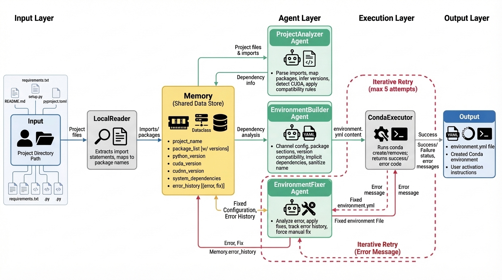

# EnvAgent

**AI-powered tool that automatically generates Conda environments for Python projects**

[](https://www.python.org/downloads/)

EnvAgent analyzes your Python codebase and creates production-ready Conda environments automatically. It uses GPT-4 for intelligent dependency detection, handles version conflicts, and self-heals installation errors.

---

## Quick Start

```bash
# Install dependencies
pip install -r requirements.txt

# Configure OpenAI API key
echo "OPENAI_API_KEY=your-api-key-here" > .env

# Generate environment for your project
python main.py /path/to/your/project

# Activate and use
conda activate your_project_name
```

---

## Features

- **Smart Dependency Detection** - Combines AST parsing with config file analysis for accurate results
- **Monorepo Support** - Automatically identifies the correct project root in complex repositories
- **Self-Healing** - Fixes installation errors automatically (up to 8 retries with GPT-4)
- **Platform-Aware** - Excludes incompatible packages (e.g., CUDA on macOS)
- **Token-Efficient** - Handles large codebases (1000+ files) without hitting LLM token limits
- **Production-Ready** - Generates validated `environment.yml` with loose version constraints

---

## Installation

### Prerequisites
- Python 3.8+
- Conda ([Download Miniconda](https://docs.conda.io/en/latest/miniconda.html))
- OpenAI API Key ([Get one here](https://platform.openai.com/api-keys))

### Setup

```bash
git clone https://github.com/yourusername/EnvAgent.git
cd EnvAgent
pip install -r requirements.txt
cp .env.example .env
# Edit .env and add your OPENAI_API_KEY
```

---

## Usage

### Basic Commands

```bash
# Analyze current directory
python main.py .

# Analyze specific project
python main.py /path/to/project

# Custom environment name
python main.py /path/to/project -n my_env

# Specify Python version
python main.py /path/to/project --python-version 3.10

# Generate YAML only (don't create environment)
python main.py /path/to/project --no-create
```

### Example Workflow

```bash
# Analyze a YOLOv5 project
python main.py ~/projects/yolov5

# Output:
# 🔍 Checking system requirements...
# 📋 Analyzing project structure...
# 📁 Filtering source files...
# 🔬 Scanning dependencies...
# 🔨 Generating environment.yml...
# 🚀 Creating conda environment...
# ✅ SUCCESS! Environment 'yolov5' created.

# Use the environment
conda activate yolov5
python train.py --data coco.yaml
```

---

## How It Works

EnvAgent uses a 6-step pipeline to generate environments:

<p align="center">
  
</p>

1. **System Check** - Validates Conda, Python, and disk space
2. **Decision Agent** - Detects monorepos and chooses analysis strategy
3. **File Filter** - Selects relevant Python files and config files
4. **Code Scanner** - Extracts dependencies using AST parsing + config analysis
5. **Environment Builder** - Generates OS-aware `environment.yml` with GPT-4
6. **Auto-Fix Loop** - Creates environment and fixes errors automatically

**See [FLOW_ARCHITECTURE.md](FLOW_ARCHITECTURE.md) for detailed technical documentation.**

---

## Documentation

- [FLOW_ARCHITECTURE.md](FLOW_ARCHITECTURE.md) - Detailed execution flow with step-by-step diagrams
- [ARCHITECTURE.md](ARCHITECTURE.md) - System architecture and technical details
- [CONTRIBUTING.md](CONTRIBUTING.md) - Contribution guidelines

**Need help?** [Open an issue](https://github.com/yourusername/EnvAgent/issues) for support.

---

**Made with ❤️ using GPT-4 and Python AST**
